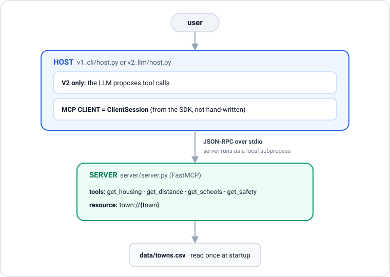

# mcp-town-explorer

A learning project that makes every MCP boundary visible: host, client, server, transport, discovery, invocation.
The trick that makes the boundaries legible is **one server, two hosts**: a no-LLM host and an LLM host talk to the exact same server with zero server changes.

## What MCP is

The Model Context Protocol (MCP) is a standard way for an application (the *host*) to let a language model use external tools and data through a uniform interface.
The host embeds an MCP *client* that speaks JSON-RPC to one or more MCP *servers*; each server advertises *tools* (callable functions) and *resources* (readable content) with machine-readable schemas.
The point is decoupling: any MCP-speaking host can use any MCP server without custom glue, because discovery ("what tools exist?") and invocation ("call this tool with these arguments") are standardized.

## Architecture



Which file is which:

- **Host**: `v1_cli/host.py` and `v2_llm/host.py`. The host owns the user interaction, and in V2 owns the LLM and the validation logic.
- **Client**: `ClientSession` from the MCP SDK, constructed inside each host. It is **not** hand-written JSON-RPC; the SDK provides it.
- **Server**: `server/server.py`. Built with FastMCP; exposes the tools and resource. Neither host imports it -- they only launch it as a subprocess and speak the protocol.

## Setup

Uses [uv](https://docs.astral.sh/uv/). Python is pinned to 3.12.

```
uv sync
```

## Run V1 (no LLM, no API key)

Argv selects the tool; the model is never involved. This isolates the protocol from model behavior.

```
uv run python v1_cli/host.py list-tools            # print the raw advertised JSON schema
uv run python v1_cli/host.py housing Winchester
uv run python v1_cli/host.py distance Winchester
uv run python v1_cli/host.py schools Lexington
uv run python v1_cli/host.py safety Woburn
uv run python v1_cli/host.py resource Winchester   # read the town://{town} resource
uv run python v1_cli/host.py --verbose housing Winchester   # log the protocol lifecycle
```

The error path, deliberately shown:

```
uv run python v1_cli/host.py housing Nowhere
# -> ERROR from server: Unknown town: 'Nowhere'. Known towns: ...
# exits non-zero; the server error surfaces across the protocol rather than being swallowed
```

## Run V2 (adds the LLM)

Natural language in.
The model sees the tool schemas, proposes a call, the **host validates it**, the client executes it, the result is fed back, and the model explains.
The loop repeats (capped at 5 iterations) until the model stops requesting tools.

Provide `OPENAI_API_KEY` either by exporting it, or by putting it in a `.env`
file and letting uv load it with `--env-file` (the `.env` is git-ignored):

```
# option A: export
export OPENAI_API_KEY=sk-...
uv run python v2_llm/host.py "Compare schools in Winchester and Lexington"

# option B: keep it in .env
uv run --env-file .env python v2_llm/host.py "Compare schools in Winchester and Lexington"
uv run --env-file .env python v2_llm/host.py --show-tokens "How safe is Woburn?"   # print tool-schema token cost
```

The validation step is the reason V2 exists.
Before any execution the host checks the proposed tool name against an **allowlist** and checks that the `town` argument **exists in the dataset**; a rejected call is logged (`[REJECTED] ...`) and never reaches the server.
The exact line where a model *proposal* becomes an *execution* is commented in `v2_llm/host.py`.

## Provenance

This dataset describes real Massachusetts towns, but it is stitched together from several sources of differing years and methodologies.
**It is a demo for teaching MCP architecture. Do not use it for any real decision** (buying a home, choosing a school district, judging safety).

Sources, one per column:

| column | source |
| --- | --- |
| `median_home_price` | Zillow Home Value Index (ZHVI), town level |
| `school_rating` | GreatSchools, rounded average of the town's public schools (GreatSchools publishes no single district number) |
| `violent_crime_rate` | NeighborhoodScout, incidents per 1,000 (2024 FBI-derived vintage) |
| `distance_to_boston_mi` | computed: haversine from the town's US Census/Wikipedia centroid to Boston City Hall (42.3601, -71.0589) |
| `population` | US Census (2020 decennial or ACS estimate) |

Per-column source URLs, vintages, retrieval notes, and known caveats are recorded in [`PROVENANCE.md`](PROVENANCE.md).
The habit is the lesson: record where every number came from, even in a teaching dataset.

## What this does NOT demonstrate

- **Deployment.** stdio transport means the server is a local subprocess the host spawns. There is no network service, no container, no host/port.
- **Auth.** No authentication or authorization between host and server. The V2 "permission boundary" is application-level input validation, not identity or access control.
- **Remote transport.** No HTTP/SSE/streamable transport. Everything is local stdio.
- **Multi-user / concurrency.** One host, one server subprocess, one user, one request at a time.
